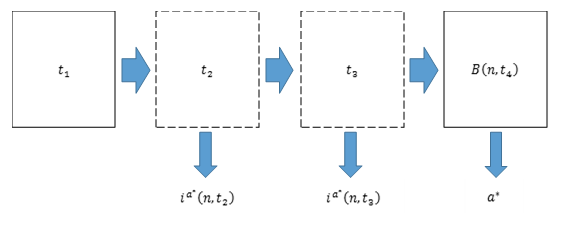
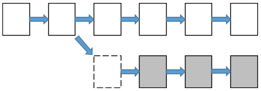

# Proof-Of-Authority (PoA)

## Introduction to PoA (Poof-Of-Authority)
Unlike PoW (Proof-Of-Work) and PoS (Proof-Of-Stake), replying on miners to mine the block, PoA strategy authorize the specific users to produce blocks with some certain rule. Compared to PoW and PoS, PoA does does not require to consume huge amount of physical energy to generate blocks. 

## VeChainThor Designed PoA Protocol In detail
When designing the consensus protocol of any blockchain one must address three basic questions:

* When is a block produced?
* Who generates the block?
* How do you choose from two canonical (legitimate) blockchain branches to establish the trunk of the blockchain (the now defined truth)?

### When

VeChainThor blocks are produced on a regular interval, `Δ`. In the initial release of the protocol, the `Δ` is set to ten seconds. Let's set t0 to be the timestamp of the genesis block. The timestamp of the block with height `n>0`, tn must be complaint with the relation that tn = t0 + m∙Δ where `m∈N and m≥n`. 

### Who

The VeChainThor PoA Protocol ensures that every masternode has an equal opportunity to be selected to produce blocks. However, to satisfy security constraints, we do not want the order of masternodes to generate blocks to be entirely deterministic. To achieve this state, VeChainThor utilizes a deterministic pseudo-random process (DPRP) and the concept of “active/inactive” status for masternodes to decide if a masternode `a` is a legitimate option to produce a block `B(n,t)` with height `n` and timestamp `t`. In this method `t` must satisfy (t-t0) mod Δ = 0. To answer who generates the block, we first define DPRP to generate a pseudo-random number `γ(n,t)` by:

γ(n ,t) = DPRP(n,t) Ξ hash(n∘t)

Where ∘ denotes the operation that concatenates two byte-arrays.

AB denotes the set of masternodes with the “active” status associated with `B`. To verify whether `a` is the legitimate masternodes for producing `B(n,t)`, we first define:

Aa B(n,t) = APA(B(n,t)) ∪ a

Where PA(∙) returns the parent block. Then compute index ia(n,t) as:
ia(n,t) = γ(n ,t) mod ||Aa B(n,t)||

MasterNode `a` is the legitimate producer of `B(n,t)` if and only if AaB(n,t)[ia(n,t)]=a. Note that we put double quotes around the word “active” to emphasize that the status does not directly reflect whether a certain masternode is actually physically active in the network at that time, but merely a status derived from their validity to produce a block within the network.

To discuss the status updates of masternodes let’s look at the situation illustrated in the above figure for an example. It shows four allowed time slots {t1,t2,t3,t4} for block production. The solid line marks the verified blocks produced on time while the dashed line is the missing blocks. For each time slot, the system can compute the index of the responsible masternode using the above equation. The system sets the status of any masternode that fails to produce a block as “inactive” and the status of the current block’s producer as “active”. In this example, after the system verifies `B(n,t4)`, it updates the masternode status associated with B(n,t4) as:

* Aa* B(n,t4)[ia*(n,t2)]<- inactive
* Aa* B(n,t4)[ia*(n,t3)]<- inactive
* a*<- active

Where a* is the signer of B(n,t4).

From the above description, it can be seen that any missing block before a legitimate block timestamp t would completely change the order of the masternodes that produce blocks afterwards. It would hence be more difficult for attackers to find out which masternode is responsible for producing a number of consecutive blocks at a time relatively far away. Furthermore, the VeChain Foundation could deliberately let the masternodes control the ability to skip producing a block occasionally to increase the unpredictability.

### How

The final question we need to answer is how to choose between two canonical blockchain branches to make the “trunk”. Since there is no computational competition in PoA, the “longest chain” rule does not apply. Instead, the VeChainThor Blockchain chooses the branch that is witnessed by more masternodes as the better of the two. To do this, the protocol computes the accumulated witness number (AWN) for block `B(n,t)` as:

πB(n,t) = πPA(B(n,t))+||AB(n,t)||

Since ||AB(n,t)||$ computers the number of masternodes that are active in associated with `B(n,t)`, This can be considered as the number of masternodes that witnessed `B(n,t)`. Therefore, the branch with the largest AWN is chosen as the trunk. If the AWNs are the same, the VeChainThor Blockchain selects the branch with less length (e.g., the greater average AWNs).

Formally, given two branches `B` and `B’` with latest blocks `B(n,t)` and `B’(n’,t’)`, respectively, the protocol first calculates their AWNs πB(n,t) and πB'(n',t'). The system then makes the following decision: choose B as the trunk if πB(n,t) > πB'(n',t'); or choose `B’` if πB(n,t) < πB'(n',t'). In case πB(n,t) = πB'(n',t'), choose `B` if `n`<`n’` and `B’` if `n`>`n’`. If `n=n’`, keep the current trunk.

### System Continuity
When considering a system’s performance, it is important to test the system continuity, or in other words, to find out in what situations that the system would halt. According the PoA protocol described above, the whole system does not require a minimum number of genuine validators to be available, like the practical Byzantine fault tolerance (PBFT) protocol does. This system enables the ability to perform multiple rounds of inter-node communications to reach consensus. No external factors could prevent an Authority Masternode from continuously performing the PoA protocol and reaching consensus about the current Blockchain state based on the information it receives from the network. In this way,the PoA protocol endows the VeChainThor Blockchain with substantial robustness and stability.

## Resolving A 51% Attack
In theory, the PoA protocol is vulnerable to the so-called “51% attack”. This term is originally used to describe an attack to a PoW based Blockchain systems such as BitCoin and Ethereum. In these cases, the “51%” stands for more than half of the networks mining power. It surely should have a different meaning in the context of other consensus protocols. In PoA, the “51%” means more than half of the current available Authority Masternodes who collude.

This attack sets the requirement to not only on the number controlled in an attack but, more importantly, on the assumption that the rebelling Authority Masternodes collude. In reality, the PoA consensus significantly increases the difficulty of carrying out such a 51% attack.

## Long Range Attacks
A long-range attack is one of most common ways to attack a Blockchain system. This attack exists when the attacker takes an old block, creates a new blockchain branch, and then tries to broadcast it to the network in an attempt to override the existing trunk. Very often, the fabricated branch is much longer than the trunk so as to fool the consensus protocol.

Normally, the long-range attack cannot be used to attack the proposed PoA protocol. The below figure illustrates a long-range attack to PoA where the white blocks represent the trunk while the grey blocks the fabricated branch. On one hand, since there has to be a ∆-second interval between two consecutive blocks, it is impossible for the attacker to produce a much-longer chain. On the other hand, PoA chooses the trunk based on the accumulation of the number of “active” Authority Masternodes. In that sense, to replace the current trunk with the fabricated branch, the attack has to gather more than half of the available Authority Masternodes to produce a larger total number than the existing branch. The attack then becomes a 51% attack which has been described above.

